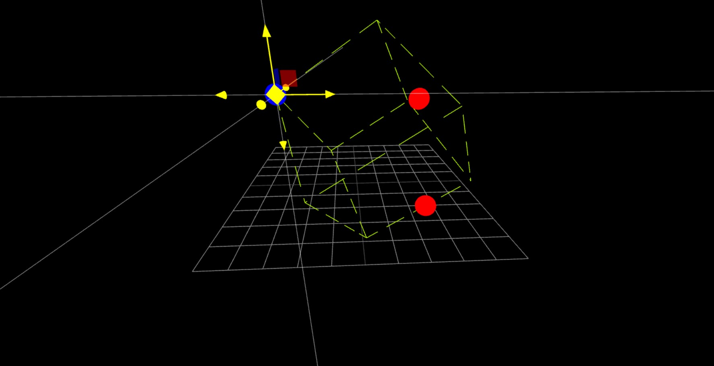

### 操作

#### Camera Control:

- **Mouse Right:** 旋转
- **Mouse Middle / (Ctrl/Shift + Mouse Right):** 平移
- **Mouse Wheel:** 缩放

#### Object Control:

- **Ctrl + Mouse Left:** 新增物体
- **Mouse Right (Click on Object):** 选中物体
- **Mouse Left (Click on TransformControls Widget):** 拖动物体
- **Shift + Mouse Left:** 选中多个物体
- **Del:** 删除选中物体

#### 触控设备:

- **长按:** 新增物体
