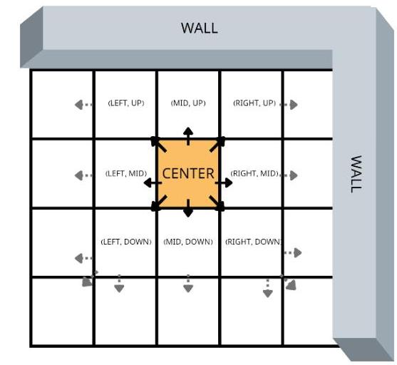
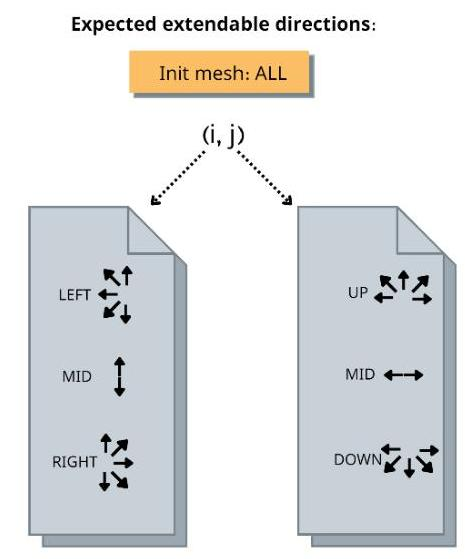
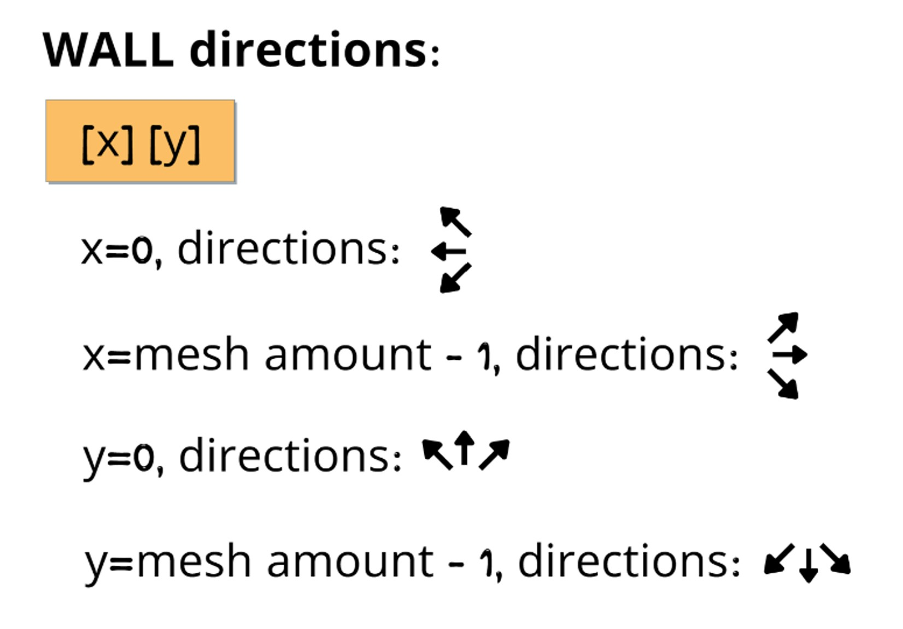
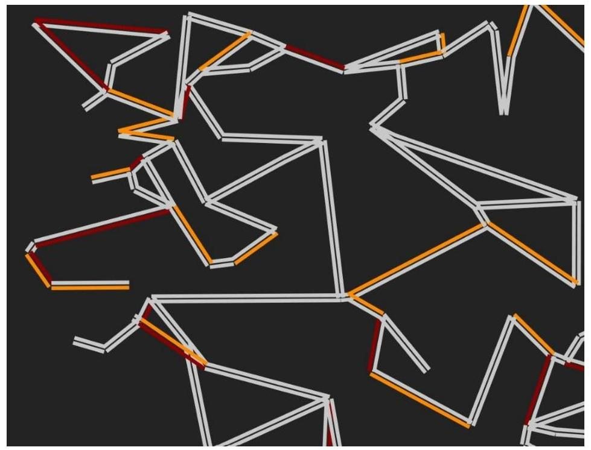
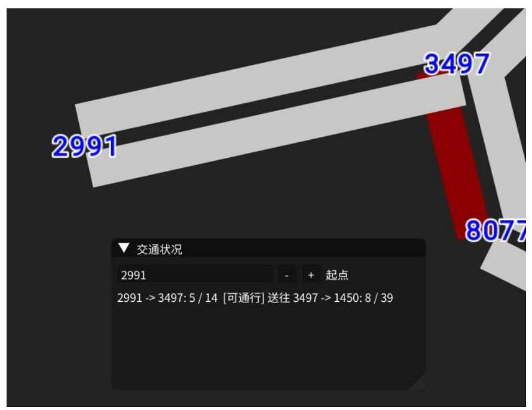
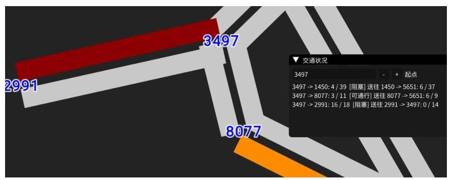
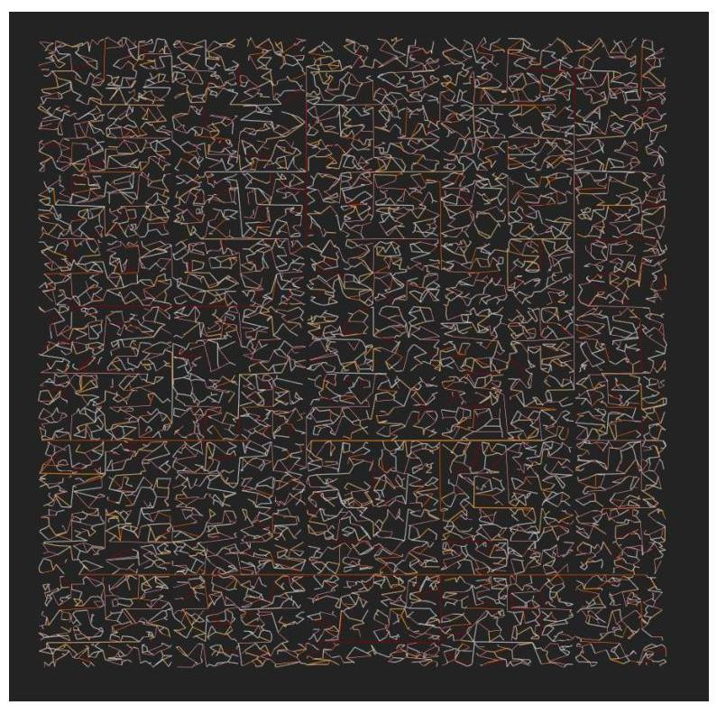
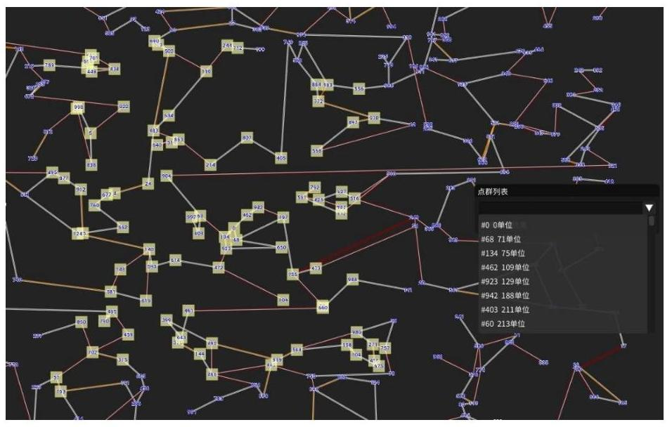
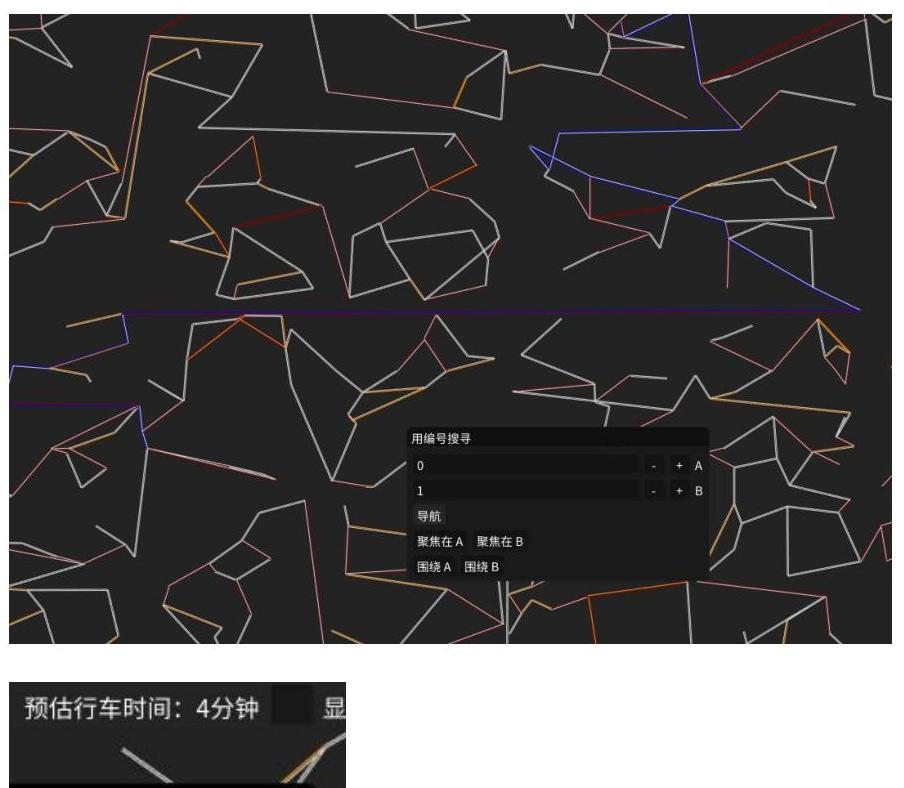

## 一、选题背景

导航系统这几十年来，技术与功能都在不停地迭代发展。为了构架出能在实时交通条件的约束下，能快速且准确地找出地图中最佳路径的系统，此项目使用了多种特定的数据结构及算法来实现要求。同时也设计了模拟地图与交通情况的功能，和导航的算法相辅相成，造就了一个完整的软件。

## 二、方案论证（设计理念）

### 最佳路径选择功能

要想选出最佳路径，地图必须是一张连通图。所以我所设计的生成算法也必须满足这个约束条件。关于生成地图的算法将在之后提到。我选择的最佳路径选择方式是使用 **A\*** 算法，这种启发式的算法将在设定好的条件下有效率地找寻花费最小的路径。同时在大数据量的压力之下也有很好的发挥。

### 交通负载处理机制

地图还需要实时的交通模拟，为此引入了交通负载处理模块。这个功能要实现 24 小时不间断地处理所有道路车流量的流通，以及根据道路的负载容纳比、路长，来更新道路的花费。我对此设计出了一套机制，来模拟出车流交换的效果。

### 红绿灯

车辆管制的存在，使得每条道路上的车辆不能为所欲为，其绝对有存在的必要性。在这一部分，我利用了道路阻塞及激活的方式来控制车流。

### 模拟连通图

这个图必须符合几个要素：

1. 必须是一张强连通图。
2. 必须不能有太多的重叠边（几何上的）。
3. 点和边的几何位置必须每次生成都是随机的。

在几何上，可以设计两组数组来存放点与边，其存放的属性包括颜色、位置等等。而在底层的数据结构上，我使用了 `LinkedList` 存储图结构，其能在有效率查找点边的基础之上，也降低了内存的浪费。在建立好相关的数据结构后，即开始进行点与边的模拟。完整模拟算法将在过程论述的章节提到。

### 网格

当利用点的编号或是坐标位置来寻找点或邻近点时，遍历整张图的所有点是不现实的。利用网格划分的结构可以很好地解决这个问题。也就是说，选定的点将会通过判断，落在某一个网格内部，只需遍历这一网格里的节点就可以满足相关的请求，而不需搜索所有点。此方法对于大数据量的查询起到优化作用。

### 邻近点问题

如果要搜寻以某一坐标为中心的最近 100 点，也不可能用所有节点对于此中心的距离得到，这一方法无疑是极度耗时的。可以利用上述的网格遍历的方式去搜索。相关的算法将在过程论述的章节提到。

### 图形渲染

本项目使用的图形渲染库是 **SFML**。另外，我也设计了一些特定功能，例如：镜头移动与缩放、点边渲染优化，以及对于不同屏幕尺寸的适配方式。而界面部分使用了 **ImGUI**。

## 三、过程论述

### 元件

一个完整的导航系统一定会有一张可视化的地图，其存在着许多的元件：最简单的地图由地点及道路构成，也对应着图结构中的点和边。

`Vertex` 类负责管理一个点的编号及各种几何属性，也就是位置以及它的大小。在这里，所有的点都被设定是大小一致的；其还有一个附属的可变色矩形元件，负责在处理临近点问题时可视化结果。

`Edge` 类管理一条边的几何属性，包括一条边的起点及终点位置、编号、颜色、粗度以及道路间距。利用道路指向向量求法线后，即可以确定道路粗度的增加方向。

网格划分功能的存在，使得我必须引入另一类 `Meshes`，其包含了一个三维数组 `container`。`container` 的作用是用来存放网格集，当一点生成时，利用前两级的下标索引来确定是哪一个网格，并在确定的网格内插入此点。

**确定网格的方式：**

```cpp
int indexX = 0, indexY = 0;

if (coord.x > 0) {
    coord.x >= _range.x ?
    indexX = _blocksInX - 1 :
    indexX = static_cast<int>(std::floor(coord.x * _blocksInX / _range.x));
}

if (coord.y > 0) {
    coord.y >= _range.y ?
    indexY = _blocksInY - 1 :
    indexY = static_cast<int>(std::floor(coord.y * _blocksInY / _range.y));
}

return std::make_pair(indexX, indexY);
```

为了减少不必要的设计困难，所有的坐标（包括 x 与 y）都约束在第一象限。`indexX` 及 `indexY` 是将要确定的网格的下标值，就一个方向的坐标而言，点坐标除以地图的总范围便可以得到点相对地图的位置比例；把这个比例再乘上这个方向的总网格数，就可以得出应该落入的网格下标。

另外，一张地图划分为多少个网格、生成多少个点，以及地图范围有多大，是由预编译的参数确定的。

### 随机点的实现

我使用了最简单的实现方式，也就是平均分布的伪随机数生成方法。利用一个伪随机数生成器去生成一个点，并藉由上述的判断式选择落入的网格，从这个网格里遍历存储的点，如果有其中一点与新生成的点位置重复，则重新生成新点。如此循环直到生成的点数量达到指定要求。

### 周边探测器

如何探测指定位置坐标上的邻近点是一个有趣的问题。正如前面所提到的，不应该用所有节点对于此中心的距离去求出结果。而因为有了 `mesh` 元件的存在，可以用一个非同寻常的方式解决此问题。我借鉴了树结构中 **Level Order Traversal** 的遍历方式，采用压入队列的手段，从而记录向下深入探测的先后顺序并得出结果。如果把中心点落入的那个网格看成根节点，剩余网格都看成其子节点呢？

不过，我们可不能像 **Level Order Traversal** 那样任意地向下深入拓展，因为网格集有边界的存在，它也是地图的边界。所以，我们得进行约束。

每一个 `mesh` 都会有以下三个集合：

- 预期拓展方向 $E$ ：这个 `mesh` 想要拓展的方向集合。
- 墙壁方向 $W$ ：探测到的墙壁（边界）方向集合。
- 实际可拓展方向 $R$ ：是预期拓展方向与墙壁方向的差集。

实际可拓展方向也可表示为：

$$
R = E - W
$$

探测开始后，从中心点的网格出发，初始网格的 $E$ 集合为所有方向，判断墙壁方向后得到 $R$ 集合，对 $R$ 集合方向的网格进行相对方向的标记。标记的形式为 $(i, j)$ ，其中 $i$ 代表水平方向， $j$ 代表垂直方向；例如图 1 中左上角的网格将被标记为 $(LEFT, UP)$ 。标记完后将被标记的网格放入队列。接着从队列里弹出一个网格，再对此进行上述的过程，直到队列为空。  
{width=500px}

$E$ 集合取决于这个网格的 $(i, j)$ 标记。除了初始网格以外，其余所有网格都应有相对应的标记。正如图所示，不同的 $i$ 与 $j$ 对应着不同的方向集合 $I$ 与 $J$ ，而

$$
E = I \cap J
$$

则完成了对当前网格 $E$ 集合的计算。  
{width=400px}

要想求得真正的拓展方向，我们还需要墙壁方向的集合 $W$ 。如图所示，只有在地图边缘的网格才会受到 $W$ 集合的制约；因此，我们只需针对边缘网格去计算 $W$ 集合即可。观察当前网格的两个下标 $(x, y)$ ，可藉由图的方式得到方向集合 $(X, Y)$ ，且

$W = X \cup Y$ ，这样我们就得到 $W$ 集合，并可以得出最终的 $R$ 集合。

每当遍历到 100 个点的时候停止，并做插入排序；如果要搜寻更多结果（也就是再往外扩张 100 个点），就再进行拓展，并把新遍历的 100 个点加入数组里，从新遍历的第一个点开始往后做插入排序。我之所以用插入排序的原因，是因为每次要排序的点规模十分的小，而且每次数组里的点群都已排序完成（除了新加入的 100 个点），所以插入排序在这种情况下应该是个有效率的算法。当然，这种方式来处理邻近点问题的前提是 `meshes` 必须分得足够细，否则结果就会十分地不精确。  
{width=500px}

### 随机边的实现

前面提到了随机点的实现方式，就是简单的伪随机数方式生成；不过到边的生成这里可就没这么简单了。前面我们提到地图上不能有太多重叠线的规定（即，不能有太多任意的两条边形成交点），因为那样会让整张图看不清楚，而我们显然要用不同的方法生成。

我参考了 Stack Overflow 上一名网友的解决方案，他的方案是：如果两点之间的连线与任意一条已经存在的边可能形成交点，则视为不可连，在层层筛选之下找出候选的点对集，并随机从中抽取一个点对进行连线。这种方法非常直觉，实现起来也非常容易，不过当地图上的点足够多的时候，问题就产生了。原因是随着已连接的边集合越来越庞大，每次连一条新边时都需要与集合内所有的边判断是否相交，时间复杂度将会是 $O(n^2)$ 。

降低时间复杂度的方式是利用分治法。因为我们已经拥有 `meshes`，所以 `divide` 动作已经完成。现在要对每一个网格内部利用上述的算法去生成边。伪代码如下：

```
inselect <- empty set
exselect <- all points array
links <- all edges created in this mesh

if exselect is empty:
    break
c <- exselect[0]
start <- c
move start from exselect to inselect

while exselect not empty:
    p <- c
    c <- exselect[0]
    candidates <- all points from inselect
    distanceToC <- empty map [id, distance]
    reconnect <- false

    loop:
        for edge in links:
            if edge intersect with (p->c):
                remove p in candidates
                if reconnect is false:
                    distanceToC <- distance to c for each point in candidates
                    reconnect <- true
                remove p in distanceToC
                p <- smallest one's id in distanceToC compared by distance
                do loop again

    add edge (p->c)
    move c from exselect to inselect
```

我另外在原有的算法基础上添加了一些执行动作。最主要解决的问题是，如果两点无法因被挡住而无法连接，该选哪一个点再重新连接？我的方案是，再从 `inselect` 中选出一个与欲连接点最近的点进行连接，如果不行就再尝试第二近的点。原因是两点如果距离很近，那么中间有边会挡住它们俩的概率应该是相对较小的。

当每个网格内都已生成好边集后，就要把所有的网格连接成为一张完整的地图，也就是 `combine` 动作。类似于归并排序，每次合并完后规模就变为原先的两倍；因为网格是在二维的空间上合并的，所以分为水平合并 `HMerge` 和垂直合并 `VMerge`。每一次的 `Merge` 动作都是对两个网格集合进行合并，`HMerge` 指的是选择左集合中最右边的两个点，与右集合中最左边的两个点进行连接；首先，两个集合中最边缘的两个点肯定没有被其他边挡住，否则一定有其他在集合里的点更加边缘。接着，尝试连接第二边缘的点对，如果被挡住了则放弃连接。同理，`VMerge` 就是选择上下边缘点对进行连接。每两个集合的 `Merge` 动作执行完毕以后便合并为一个单独集，并放入一个二维数组中，以便接下来的 `Merge` 动作使用。持续反复轮替地执行 `HMerge` 与 `VMerge`，直到二维数组里只剩下一个集合时，整个 `combine` 动作就完成了。

### 图的数据结构

上述提到的点与边都是属于几何与坐标层面，也就是说不与数据结构中的有环无环、邻居，以及连通等特性有关。现在，为了实现交通模拟以及导航功能，我们开始实现底层的数据结构。

我使用的数据结构是基于邻接链表的形式，这样可以节省不少内存空间。在这个数据结构中存在着一个数组 `vertex`，其存放了在这个地图上所有点的编号（利用下标标示）。而数组里的每一个点对应着另一组动态数组 `to`，表示多个出边。在 `to` 中的每一个元素称为一个 `ConnectTo`，表示一个出边。因为 `to` 的平均规模并不大，所以我认为不需要特别为其建立索引以供查找边使用。

### 交通吞吐

接下来就是如何设计交通模拟机制的问题了。我认为交通模拟的核心原则就是：吞与吐。只要有一条边 $(u, v)$ 上的车辆离开，就代表着这辆车一定会驶入边 $(v, w)$ ，其中 $w$ 是 $v$ 的邻居。现在我们必须引入几个名词以及其英文名称：

- **长度 length**：一条边的欧氏距离长。
- **容量 capacity**：一条边所能容纳的最大车辆数。
- **负载 load**：一条边在当前时刻的车辆数。
- **速度 speed**：一条边以几秒为一个周期吐出一辆车给其邻边。
- **花费 cost**：在这条边上从起点行驶到终点所需的时间。

其中 `length`、`capacity` 在模拟前就已经确定，为不可变值；`load` 为模拟前经过伪随机产生的值，是后期可变的；至于 `speed` 和 `cost` 则是根据上述参数动态改变的。一条边的 `cost` 计算公式为：

$$
\operatorname{cost} = c_{1} L f(x)
$$

其中 $x$ 参数代表当前负载容量比， $L$ 为 `length`， $c_{1}$ 为一常数， $f(x)$ 为一分段函数；假设一常数 $c_2$ ，则：

- 当 $x \leq c_2$ 时， $f(x) = 1$ 。
- 当 $x > c_2$ 时， $f(x) = 1 + e x$ 。

#### 初始化

当一条边被初始化时，先利用它的 `length`、`capacity` 以及 `load` 评估此边的初始 `speed` 以及初始 `cost`。`cost` 的评估方式由上式给出，`speed` 评估方式则为：

$$
\text{speed} = \text{cost} / \text{load}
$$

也就是说当一条边上从起点行驶到终点的时间不变的情况下，车数量越多，每吐出一辆车的周期间隔就变短。这似乎没有逻辑，因为通常一条路上车辆数目如果很大，理应上不会更通畅；而这是因为道路之间并没有设立“阻塞”管制。考虑所有车辆的速度均固定且相同，且没有车辆管制，也不会有任何车辆因为某种原因慢下来，那么上述的理论就成立。

#### 计时器与吞吐机制

为了在程序的每一次循环中检查所有的边时，不需要将每一个边都改变其动态变量（`cost`、`speed` 等），我们要在每一条边上增加一个计时器 `clock`。每当循环检查到一条边 $x(u, v)$ ：

$$
\text{clock.elapsed}_x \geq \text{speed}_x
$$

则代表是时候让计时器重新归零，并吐出一辆车了。接着从出点 $v$ 去随机找寻一条饥饿边（`starved edge`），我们把这条选中的饥饿边命名为 `forward`。并执行以下动作：

- `forward` 必须保证不为满载： $\text{load}_{\text{forward}} \neq \text{capacity}_{\text{forward}}$ 。
- $x$ 保证负载不能为空。
- 如果上述两条件有一不成立，则放弃此次车辆移转。
- 将 $x$ 的负载数减 1，`forward` 的负载数加 1。
- 重新评估 $x$ 和 `forward` 的 `cost` 与 `speed`。

#### 红绿灯

要更准确的模拟出现实世界的路网，我们就需要设计出红绿灯机制，也就是将每条边分为“阻塞态”与“可通行态”两种状态。最简单的红绿灯规则即是：由每个点来控制其所有出边的状态，且一个时间段内只允许一条出边为可通行态，其余为阻塞态；且选中的这条可通行边必须与上一条可通行边不相同，除非出边只有一个。为此，每个点需要有两个附属对象：

- **周期 cycle**：几秒更新一次每条出边的状态。
- **计时器 clock**：功用与设计交通吞吐时用到的计时器相似，当地图上的一点 $v$ ，其 $\text{clock.elapsed}_v \geq \text{cycle}_v$ 时，则将计时器归零并根据上述原则随机选一条出边为可通行边。

因为红绿灯机制是为交通吞吐服务的，所以我们得再回顾一次上一节的内容，并在这次加入一些新东西。在每一条边选择 `forward` 的时候都会有几项前提条件，如果不符合则放弃此轮的车辆移转。现在我们再加入一条新规则：如果边 $x$ 的状态为阻塞态，则同样地放弃此轮。在这些规则的约束下，整个路网的交通状况就会是实时动态，且贴近现实的。

### 最佳路径

在有了边上的花费计算方式（由长度及交通情况影响）以后，最终便可以利用最短路径算法求出最佳路线。我使用的是 **A\*** 算法，其在 **Dijkstra** 算法上做了不少的改进。**A\*** 算法的核心是利用设计好的估价函数，去估算当前点到终点的花费。

首先，先建立 **Open 表** 与 **Close 表**（它们其实是两个集合），从起点开始计算总花费；总花费：

$$
F(x) = G(x) + H(x)
$$

其中 $G(x)$ 代表起点到 $x$ 点的目前实际最短花费（可能在未来下降）， $H(x)$ 代表从 $x$ 点到终点的估计花费（初始为恒定值）。为此，我们需要 `F` 表和 `G` 表以便记录计算结果供后期运算使用；每次计算完后都应该把结果存入 `F` 表和 `G` 表。

现在，当起点计算完预估总花费后，我们便开始进入当 **Open 表为空时才跳出的循环**。在此循环的一开始，我们会从 **Open 表** 中选出一点 $s$ ，它是在 **Open 表** 中预估总花费最低的一点。接着遍历它的邻居。对于它的每一个邻居 $t$ ，如果

$$
t \notin \text{Open} \quad \wedge \quad t \notin \text{Close}
$$

表示此点为一新点，须计算其初始 `F`、`G`、`H` 值并保存；`G` 的计算方式如下：

$$
G(t) = G(s) + \operatorname{cost}(s, t)
$$

以下的 `cost` 用 $w$ 来表示。

不过如果 $t$ 存在于 **Open** 或 **Close** 表当中，那么就表示此点是一个旧点，已经存放了之前的 `F` 值与 `G` 值，我们必须重算一次 `G` 值并比较哪一个 `G` 值更小：

> 假设之前的 `G` 值是由另一点 $u$ 与 $t$ 形成的边去计算的，那么如果  
>  $G(s) + w(s, t) < G(u) + w(u, t)$ ，  
> 就表示走边 $(s, t)$ 的花费显然比走边 $(u, t)$ 的花费少。

如果当前算出来的 `G` 值更小，则把此点的 `G` 值与 `F` 值都更新；特别地，对于 $t \in \text{Close}$ ，应该要把 $t$ 从 **Close 表** 中移至 **Open 表** 中。

除了计算与更新花费以外，为了能回溯追踪最佳路径，对于每次遍历的 $t$ 都需要另外记录它的 `parent` 对象，在这里就是 $(t, s)$ 。而在所有的邻居 $t$ 都访问完后，将 $s$ 从 **Open 表** 中移入 **Close 表**，并重新进行此循环，直到 $s$ 为终点。

在迭代到 $s$ 为终点后，便开始进行回溯求路径；通过查找 **Parent 表** 得知当前点是从前面的哪个点连过来的，直到回溯到起点即获得最终结果。

我的 $H(x)$ 使用的计算方式是求欧氏距离 $L_E$ 乘以一系数 $c_1$ （就是在交通吞吐中提到的那一个），也就是 $c_1 L$ （以下 $c_1$ 由 $c$ 代替）； $H(x)$ 必须保证小于等于点 $x$ 到终点的实际花费，才能保证产生一条最佳路径。假设实际上 $x$ 到终点经过了 $n$ 条边，每条边的花费为 $w_1, w_2, \ldots, w_n$ ，且 $x$ 到终点的实际花费为 $R(x)$ 。可知

$$
c \sum_{i=1}^{n} L_i \leq R(x) = \sum_{i=1}^{n} w_i \leq c(1+e) \sum_{i=1}^{n} L_i
$$

而因为

$$
L_E \leq \sum_{i=1}^{n} L_i
$$

可得

$$
H(x) = c L_E \leq c \sum_{i=1}^{n} L_i \leq R(x)
$$

如此便可以证明一定可以求出最佳路径。

## 四、结果分析

{width=500px}

程序可以正常地模拟出点、边，以及交通状况。

{width=500px}

不同的颜色对应着不同的负载状况。白边为空闲状态，橘边为紧张状态，红边为接近满载。可以通过查询看到当前每条边上的车辆数、容量，以及可否通行。

{width=700px}  
{width=500px}

上图为 10000 个点的模拟情况，程序也保持正常运作。

{width=700px}

可查询给定点或坐标的邻近 100 个点，甚至更多。并且可给出每一个点距离中心点的单位。

{width=700px}

可以利用点编号或坐标查询最佳路径，并给出预估行车时间。

## 五、课程设计总结

这次的数据结构大作业让我学会如何利用学习到的数据结构以及算法知识，来建构出一个效率高，且稳定的导航系统。从设计一开始的手足无措，到后期学会先把模型架构完善、相关的数学理论想好，以及从伪代码开始设计，让我开始学习有层次地去设计一套解决方案。

虽然这次设计的导航系统仍然有一些瑕疵以及针对大数据量的效能问题，不过也已达到了我心目中的标准分，而且我也在设计算法与分析算法这一块收获以及成长了不少。另外，我也需要培养自己阅读英文论文的能力，毕竟把国外权威研究的知识转化为自己拥有的，再加以改进，才能做出更优秀的作品。期待自己在日后能达到上面的自我期许。

## 参考文献

[1] Clifford A. Shaffer. _Data Structures and Algorithm Analysis in C++, Third Edition_: 2011.386-390.  
[2] Prune. _Generate random edges between vertexes without intersection._ https://stackoverflow.com/a/53891029/16763946  
[3] 罗家山的蚊子. _导航路径规划之五 A\*算法._ https://blog.csdn.net/autonavi2012/article/details/80923431 (遵循 CC 4.0 BY-SA 版权协议)
