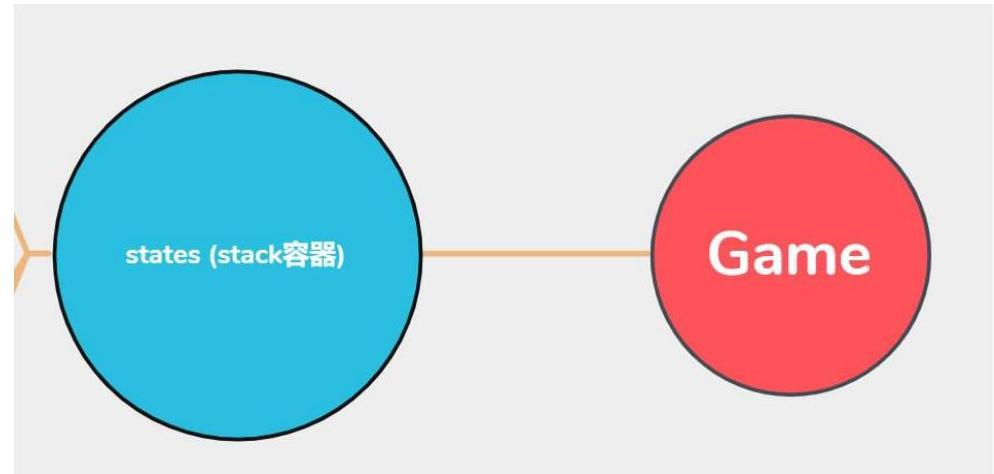
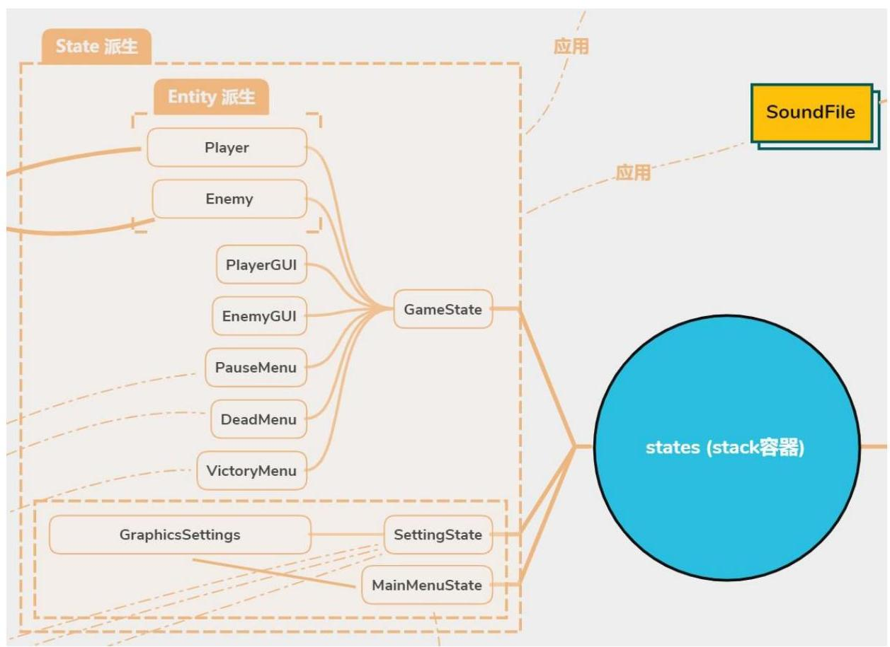
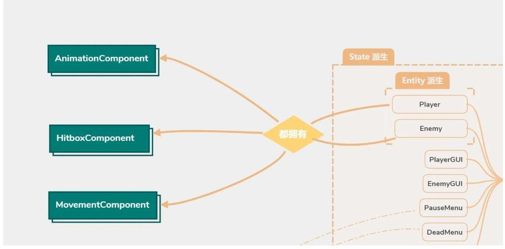
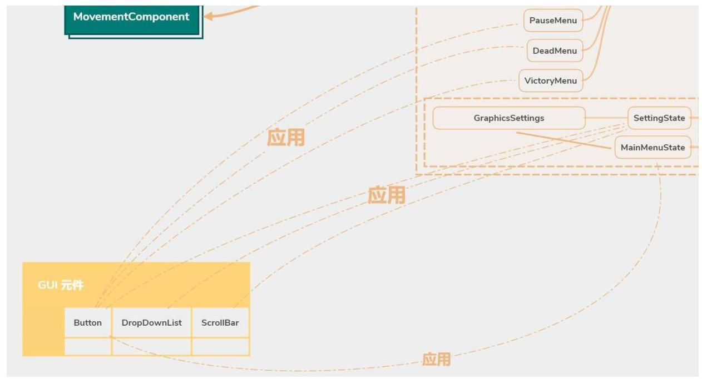
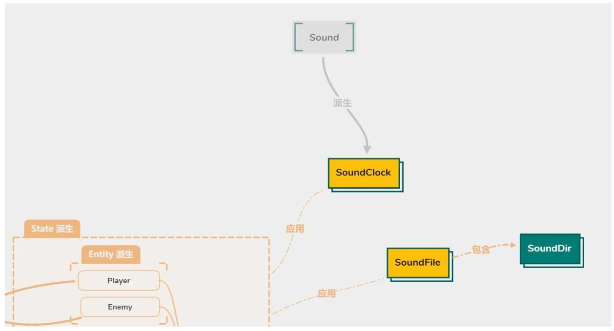
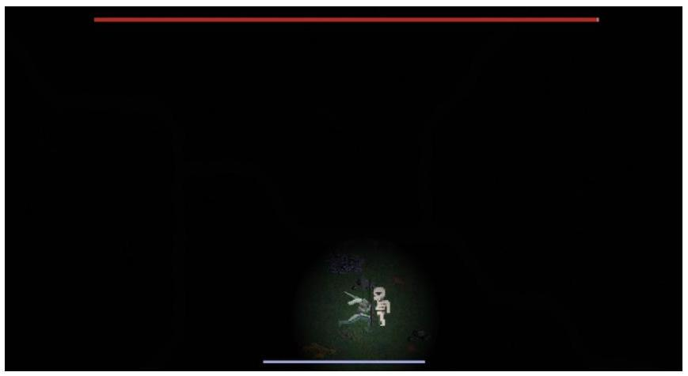
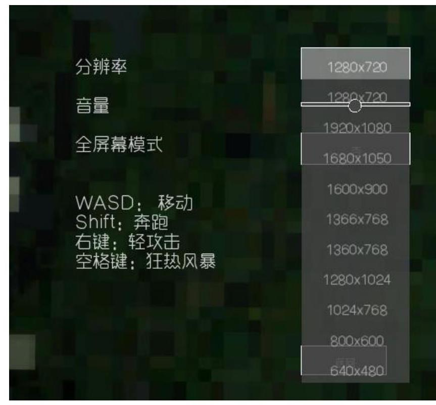

## 一、选题背景

单人角色扮演式的打斗游戏是我们最初的构想。此次游戏关卡为一片段剧情，主角是一位拥有特殊技能的战士，奉命去击杀大魔王：枯萎（Wither）。本次关卡设计的特点是强调利用特殊的走位，以及技巧性的攻击来打倒魔王。

角色扮演游戏（Role-Playing Game，RPG）无疑是近几年最具代表性与指标性的游戏类型；它是一种玩家通过操控特定角色，与敌人战斗的类型。本款游戏融入了类似的元素，使得游戏体验过程中更有代入感。而动作游戏（Action Game，ACT）的元素类型也加入了本款游戏中，使得它更重视玩家的反应能力和手眼配合，也更具刺激性。

## 二、方案论证（设计理念）

在本次大作业之中，我们小组通过学习并且运用基于 C++ 的 SFML 库，来实现游戏的图形化及其他进阶功能。我们本次设计的游戏有许多主要功能，包括但不限于游戏模块、显示与音效设定模块、菜单按钮选择模块。

游戏的核心类从 `Game` 开始，在 `Game` 里面包含着一个堆栈容器 `states`，用来处理并堆叠游戏的状态。

在 `states` 里存储着 `State` 类型。`State` 类为一基类，底下有三个派生类：`GameState`、`SettingState` 以及 `MainMenuState`。`states` 容器的顶端永远是目前用户所位于的状态，而当用户跳出当前状态后，容器顶端则执行 `pop` 动作。

在 `GameState` 类中，包含着 `Player`、`Enemy`、`PlayerGUI`、`EnemyGUI`、`PauseMenu`、`DeadMenu`、`VictoryMenu` 类的对象。另外，`Player` 与 `Enemy` 属于 `Entity` 的派生类。以下是关于这些类的介绍：

1. **GameState 类**：`State` 的派生类，游戏状态，在此状态下与敌人对战。
2. **Entity 类**：控制实体可移动物件的抽象类，含有设置血量、攻击数据输出控制、更新状态、渲染、设置纹理材质、使用坐标方式移动物体、边界限制、生成元件等函数。
3. **Player 类**：控制玩家物件的类，除了 `Entity` 类派生下来的功能以外，还新增了回复血量、更新动画、控制攻击方向、攻击判定等函数。
4. **Enemy 类**：控制敌人物件的类，除了 `Entity` 类派生下来的功能以外，还新增了更新动画、控制攻击方向、攻击判定等函数。
5. **PlayerGUI 类**：生成并更新有关于玩家生命值、体力值的使用者界面。可实时依据玩家状态，更新量条的颜色、大小，以及位置，并且渲染。
6. **EnemyGUI 类**：生成并更新有关于敌人生命值的使用者界面。可实时依据敌人状态，更新量条的颜色、大小，以及位置，并且渲染。
7. **PauseMenu 类**：暂停选单。拥有新增按钮、判定按钮点击、渲染结果等功能。
8. **DeadMenu 类**：当玩家死亡时则会使用此类。除了上述 `PauseMenu` 的功能以外，还包含了更新游戏提示文字的功能。
9. **VictoryMenu 类**：当玩家胜利时则会使用此类。拥有与上述 `PauseMenu` 类似的功能。

在 `SettingState` 与 `MainMenuState` 里，同样使用了一个 `GraphicSettings` 类的对象。

1. **SettingState 类**：`State` 的派生类，设置状态，进入设置状态时可以调整屏幕分辨率，音量大小，以及是否全屏，可以回到主菜单。
2. **MainMenuState 类**：`State` 的派生类，主菜单状态，在主菜单中开始游戏，进入设置，退出游戏。
3. **GraphicSettings 类**：可以读取使用者存储在电脑里的显示设定档，也可以写入新的设定。

以下是有关于 `Player` 与 `Enemy` 都拥有的类对象:

`Player` 和 `Enemy` 类之中都包含有 `AnimationComponent`（动画组件）、`HitboxComponent`（碰撞箱组件）、`MovementComponent`（移动组件）这三个类。此外，`AnimationComponent` 类之中还包含了 `Animation`（动画）类。对于这三个组件类以及动画类的介绍如下:

1. **Animation**：通过时间的变化来移动顶角坐标，读取 `texture`（材质）图像中不同的图像，实现动画，并且有播放动画以及重置动画等功能。
2. **AnimationComponent**：存有一系列的动画，可以设置优先播放的动画（比如说一边走一边攻击就播放攻击动画，而不是行走的动画），根据需求来切换播放不同的动画。
3. **HitboxComponent**：碰撞箱组件，检测玩家与怪物的武器的碰撞，以及怪物和玩家武器之间的碰撞。
4. **MovementComponent**：移动组件，让速度渐进地变化，让移动变得更加平滑。

下面这张图片是 GUI 元件在设计之中的应用:

我们在 `Gui.h` 中定义了 `Button`（按钮）、`DropDownList`（下拉清单）、`ScrollBar`（滚珠滚动条）三个类，其中的 `Button` 类运用在主菜单、暂停菜单、设置菜单、死亡菜单、胜利菜单之中，玩家通过鼠标左键单击这些按钮来实现互动和调整。`DropDownList` 和 `ScrollBar` 运用在了设置菜单之中，便于直观地进行分辨率的调整和音量大小的调整。

1. **Button 类**：通过鼠标点击按钮做出变化和调整。
2. **DropDownList 类**：下拉选单，能够从打开的选单中选择选项，做出变化和调整。在调整屏幕分辨率时，能够显得更加直观。
3. **ScrollBar 类**：滚珠滚动条，通过调整滚珠在滚动条上的位置，进行相关调整。调节音量时会比较直观。

我们在最后设计了一个音效类 `SoundClock`，由 SFML 库中的 `Sound` 类派生而来，在原来的基础上增加了音效缓冲区以及计时器。我们也加入了 `SoundFile` 类，其中包含着 `SoundDir` 类对象，来记录音效档案路径，以提升开发效率。

我们的设计思路是这样的：首先我们需要 `Game` 类来处理游戏的循环，`Game` 里有状态的堆栈，因此设计了虚基类 `State`，然后我们进入游戏之后见到的首先是主菜单，因而需要设置 `MainMenuState`（主菜单状态）类，接下来还需要点击各个按钮进入到不同的状态之中，便设计出了 `Button` 类。

点击开始游戏进入游戏状态，设计一个 `GameState`（游戏状态）类，在 `GameState` 类之中，进行打斗游戏，游戏之中需要有一名玩家和一只怪物，故需要设计一个 `Entity`（实体）类，由此派生出 `Player`（玩家）类和 `Enemy`（敌人）类，很多重要的功能都将在 `GameState` 之中实现，比如说怪物的 AI、玩家体力值的变化等等。玩家和怪物之间的相互攻击需要有碰撞的判断，因此设计出了 `HitboxComponent`（碰撞箱组件）类。玩家和怪物都需要是会动的，所以就有了 `Animation`（动画）类，通过移动材质图片，让玩家和怪物的材质动起来，使得玩家和怪物都有动画。而动画又分为很多种，攻击的动画、行走的动画、受伤的动画，需要设置优先动画和对动画进行切换，这样子就需要一个拥有这些功能的 `AnimationComponent`（动画组件）类。要使玩家和怪物的移动得到控制，就需要一个 `MovementComponent`（移动组件）类来控制他们的移动。在游戏之中，我们希望游戏是可以暂停的，暂停时要有暂停菜单，因此要设计 `PauseMenu`（暂停菜单）类，在玩家被怪物杀死时需要弹出死亡界面让玩家选择重来或者退出，从而需要设计 `DeadMenu`（死亡菜单）类，如果是玩家把怪物杀死了，那就要弹出一个胜利界面，让玩家选择再来一次或者是退出，就要设计 `VictoryMenu`（胜利菜单）类。玩家和怪物都有相应的生命值，随着他们各自被攻击，生命值会减少，玩家还可以回血，于是需要写出 `PlayerGUI`（玩家界面）类和 `EnemyGUI`（敌人界面）来展示玩家和怪物的血条，让生命值的变化更加直观。

一个游戏当然需要有设定，于是我们又设计了一个设定状态，就写了 `SettingsState`（设置状态）类，在主菜单之中点击设定就可以进入设定状态，进入设定界面，在设定界面中，需要调节分辨率，于是我们就设计了一个下拉菜单类，`DropDownList`（下拉清单）类，来方便我们选择分辨率，还要有一个能够调节声音的音量滚珠滚动条，这就是 `ScrollBar`（滚珠滚动条）类，依据滚珠在滚动条上的位置确定当前所需要的音量。

游戏倘若没有声音的话将会是枯燥的，因此，各种按钮的音效、怪物和玩家行走的声音、攻击的声音、受伤的声音也很有必要，引人入胜的主菜单音效和激动人心的战场音乐也是不可或缺的重要因素，此外，如果角色可以随机地说话，游戏将会变得更加有趣。因此我们就设计出了 `SoundClock` 类、`SoundFile` 类以及 `SoundDir` 类来读取声音。

## 三、过程论述

我负责设计了 `HitboxComponent`、`DeadMenu`、`VictoryMenu`、`PlayerGUI`、`EnemyGUI` 以及 Sound 相关类，也主要负责了其余类中血量数值交换的功能。另外还制作了游戏中的动态光源效果。

### HitboxComponent

- **数据成员**：碰撞箱、偏移量、碰撞箱可见布尔值。
- **函数**：取得或设置位置（向量形式）、偏移量，判断是否与其他碰撞箱有交集（`intersect`）。
- **更新函数 `update()`**：利用物件的位置与偏移量，实时更新碰撞箱的位置。

### DeadMenu, VictoryMenu

`DeadMenu` 和 `VictoryMenu` 仿造了 `PauseMenu` 的设计方式，在 `PauseMenu` 的基础上添加了个别的元素。

- **数据成员**：字型、文字、按钮，以及一个随机数产生器（用来随机产生提示文字）。
- **构造函数**：初始化各种文字按钮以及背景的大小、位置。另外，`DeadMenu` 构造函数有独特的功能。每当 `DeadMenu` 构造函数调用（玩家死亡）时，利用 `hintRand` 随机数产生器生成一个 `[1,10]` 区间的整数，再利用 `switch` 选择一个相符的文字叙述渲染出来。

### RandomGenerator（随机数产生器）

- **随机数产生功能**：首先利用互斥锁（`mutex`）使当前变量不受干扰，再来利用 `<random>` 里的 `std::uniform_int_distribution<int>` 以及 `std::uniform_real_distribution<float>` 两个模板类的对象生成出乱数。

### PlayerGUI, EnemyGUI

- **数据成员**：字型、文字、剩余血条图形、已扣除血条图形、血条宽度与长度，以及血量和能量百分比。
- **函数**：初始血条宽度、颜色和位置。
- **更新函数**：利用实物 `Entity` 类型对象的血量 `hp` 和最大血量 `hpMax`，实时更新百分比 `percent`。接着，根据百分比高低，实时更新血条大小、颜色。

### SoundDir, SoundFile

`SoundDir` 使得呼叫档案路径时有了更简便的方式。`SoundFile` 则是建立在 `SoundDir` 的基础上，使得存取声音档案更加有效率。

- `SoundDir` 中每个函数对应着文件夹的名字，使得用户不需要在每一次调用路径时都需要重新输入一次完整的路径名。用户只需要在实参处输入简单的音档名，函数便会合成为完整路径并回传。
- `SoundFile` 里含有一个 `SoundDir` 对象。为了让用户能方便地在 IDE 软件中快速浏览所有可用的音档，`SoundFile` 等同于把 `SoundDir` 合成回传的路径字串存为 `string` 数据成员。甚至在某些地方建立 `vector` 容器，使得在之后能快速实现随机存取音档。

接下来的内容不是由我完全开发的类，而是开发了类当中的部分功能。

### Player, Enemy

- `isAttackSuccessful`：如果实物正在攻击，且武器碰撞箱与对手碰撞箱接触到，则回传 `true`，否则回传 `false`。
- `updateRecover`：在每一次游戏回圈（`Game loop`）里增加玩家血量。如果玩家血量大于 `0` 时，按照不同血量情形，设置不同的回血倍数，造成不同的回血效果。
- `updateWeaponHitboxDir`：如果实物正在移动，根据面对的不同方向，更新武器碰撞箱的位置。

### GameState

- `playerUpdateHP`, `enemyUpdateHP`：设计在玩家或敌人攻击对手的时候，计时器开始计时。如果在一定时间后（也就是武器真正碰触到对手之后）实物依然处于攻击状态，且 `isAttackSuccessful` 回传为真，则扣除对手一部分血量，反之则重新计时。
- `getDistance`：使用勾股定理，藉由两实物的直角坐标计算出距离长。
- `updateXXXMenuButtons`（此类型有三个不同函数）：更新暂停选单、胜利选单以及失败选单。相同地，选单有「重新开始」按钮，可 `pop` 当前状态并 `push` 一个新的 `GameState` 状态；「离开」按钮则会跳出当前状态，使第二状态成为顶层状态。`PauseMenu` 有第三个「设定」按钮，可以 `push` 一个 `SettingState` 状态。
- `updatePlayerInput`：更新玩家输入，当玩家按住 `Shift` 时，最大速度和加速度变快。当实物攻击时，增大碰撞箱。
- `updateMenuState`：当游戏正在进行时，隐藏光标、更新玩家输入、播放背景音乐以及更新死亡状态、行走声音、对话；当暂停或进入任何其他选单时，显示光标、停止更新玩家输入、暂停背景音乐及任何音效。
- `updateDead`：死亡状态为真时，开始播放死亡动画，以及启动计时器。死亡动画结束后则标记已经死亡，不会再进入播放条件式。当计时到一定时间点，播放死亡提示声，且计时器重新计时。
- `updateDialg`：每隔一段时间，利用随机数产生器产生一个数字，用此数字间接访问 `SoundFile` 里相关 `vector` 容器的其中一个元素，并播放音效。可惜此实现敌人的对话声音。
- `updateWalkingSound`：利用触发器（`trigger`）布尔值的真假，实现只播放一次循环音效的目的。当移动时，播放行走音效；奔跑时，播放奔跑音效；停止移动时，停止所有移动有关的音效。

### State

- `allocSound`：一个用来分配音档内存空间的函数。首先建立一个 `unordered_map<unsigned int, SoundClock*>::iterator` 的迭代器 `it`，接着进入 `do-while` 回圈。利用随机数产生器产生一个介于 `0` 到 `127` 的数字来分配空间给音档，但如果使用 `it` 遍历容器后发现此空间已被使用，则继续回圈直到找到未使用空间为止。函数回传最后给定的随机数。
- `cleanSound`：在 SFML 库中规定，在内存之内的音效总数量最多只能有 `128` 个。为了避免过载，必须随时清理已播放完的音效。每当一音效开始播放，即一并调用此函数。首先同样建立一个迭代器 `it`。接着遍历整个容器，每当发现有已停止的音效，便会使用 `delete` 和 `erase` 消除所存的指针以及指针所指向的对象。
- `muteVolume`：使用迭代器遍历整个 `unordered_map` 容器，将每个元素指向的 `SoundClock` 对象音量设置为 `0`。
- `pinX`, `pinY`：实参为比例值（`ratio`）。会调用视窗大小来回传经过比例值调整后的直角坐标。

### 动态光源

利用 GLSL 语言，构建出一个以 OpenGL 为接口的着色器，并仿制了一个开放源代码的程序模版，经细微调整后成为了本次专案中的自订着色器。经 `render` 函数渲染后显现于画面中。

## 四、结果分析

我们小组所预期的功能全部实现，有基本的、可预期的游戏互动结果。玩家和敌人会在正确的时间点扣血、补血，数值处理也正确。

设置界面可正常操作。

## 五、课程设计总结

这次的游戏设计让我学习到了很多程序开发者使用的工具、技巧，以及思想。从一开始应用到库（`lib`）的概念，到之后为了方便与同学合作开发，学习如何使用 Git 与 GitHub，到后来为了引入更多功能与方便开发，接触到了 CMake 与 vcpkg 等工具。往后我一定会接触到更多工具与平台，所以不断学习、增广见闻是我要一直做的事。

以前当我的程序有 bug，或是不知道该如何设计时，我第一个想法可能是去问老师或同学。但发现了老师和同学也有自己的事情要忙后，我更应该自己解决这些事。所以这次开发专案时，翻书、去 Stack Overflow、CSDN 等网站与论坛交流成为了我寻求解答的主要方式，同时也训练了我自己找问题、解决问题的能力。

另外，这次的游戏开发虽然有符合我们当初的预期，但还是有非常多未实现或未优化的功能，使得游戏丰富度大打折扣，我认为这是稍微可惜的地方。也同时了解到，如果单纯开发游戏而不使用游戏引擎，选择从零开始，是一种绕远路的行为，辛苦且复杂；不过这样的远路，却让我更加深入地了解游戏开发的底层基础，对于往后的学习有一定的帮助。期待在接下来的日子里，我能学到更多，实现出一个有一定丰富度的游戏或应用程序。

## 参考文献

[1]《C++ SFML RPG》——Suraj Sharma https://www.youtube.com/watch?v=IdKZpv6xqdw&list=PL6xS0sbVA1ebkU66okpi-KViA08_9DJKg  
[2]《C++程序设计基础（上）》——周震如 林伟健 编著  
[3] _Mastering SFML Game Development_ —— Raimondas Pupius
