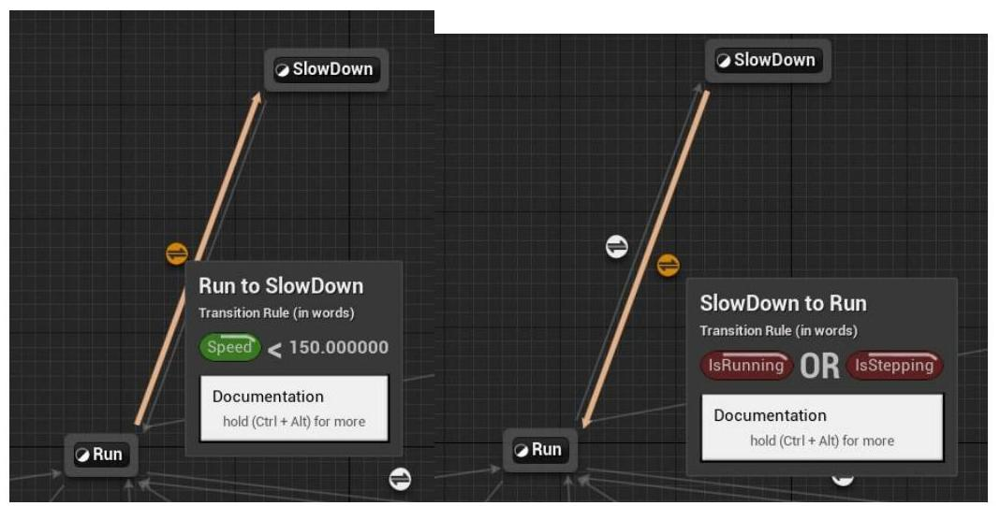

本项目在 Epic Games 官方提供的 Shooter Game demo 的基础之上做了修改，通过修改 demo 学习到了：

**Gameplay**、**AI 行为树**、**骨骼动画**、**UMG UI 设计**等内容

## 场景中创建一个炮台

我的方案是，建立一个 Pawn 名为 `BP_Fort`，其 Components 如下：  


- **Body** 是炮台的实体主体，有几个附件。
- **Arrow** 永远指向炮台前方。
- **Camera** 用于使用炮台时切换视角。
- **ParticleSystem** 用于炮台发射时，有关于炮台的闪光粒子特效。
- **SphereCollision** 用于玩家是否进入操控范围的检测。

### Variables:

- **Holder**：炮台对象目前的持有者。  
  

### 玩家可以操控炮台左右转

为了能操控炮台，设定 InputAction **UseFort** (Press "E")。

在 `PlayerPawn` 中定义事件触发后执行如下蓝图节点：  


`PlayerPawn` 中有两个 Variables：

- `bFortAllowed`（是否进入可操控炮台的范围内）
- `HoldingFort`（范围内占有[不代表操控]的炮台）

当 `bFortAllowed == true` 时执行 `PossessToFort`，并将 `HoldingFort` 中的 `Holder` 设为自身。

#### PossessToFort (Blueprint):


在 `BP_Fort` 中，事件触发后执行 `PossessToPlayerPawn`。

#### PossessToPlayerPawn (Blueprint):


### 如何判断玩家是否在可操控炮台范围内？

- 使用 `Event ActorBeginOverlap`，当 `OtherActor` 为 `BP_Fort` 类对象时，设定 `bFortAllowed` 为 `true`，并且设定 `HoldingFort` 为该炮台对象。
- 至于离开范围的判定使用 `Event ActorEndOverlap`，并对上述进行逆操作。

### 上下 & 左右转

在本次设计中使用 WASD 进行炮台旋转，设置 InputAxis **MoveForward** 及 **MoveRight** 事件的处理方法。

- **左右转**较为简单，只需使用函数 `AddRelativeRotation(输入参数 DeltaYaw)` 即可。
- **上下转**需考虑 Range（设定在 0~80 度之间），否则会产生旋转方向混乱。
- 接着再设计函数 `PredictionIsOutOfRange` 判断在这一次上下转操作中是否将会超过 0~80 度，
    - 如果是，则启用自定义的 `AdjustToEdgeRotation` 方法，会限制角度在端值。
    - 否则启用自定义的 `RotateRegularly` 方法，照常上下旋转（`DeltaPitch`）。

### 炮弹如何开火?

设置 InputAction **Fire** (Press "LMouseButton") 触发 `StartFire` 函数。

先介绍几个 Variables:

- `bIsFiringWeapon`: 当前正在发射。
- `FireRate`: 发射频率。

#### StartFire (Blueprint):

当 `bIsFiringWeapon == false` 时，可发射，并将 `bIsFiringWeapon` 设为 `true`。接着 `SetTimer(Time: FireRate)`，最后触发 `HandleFire` 事件。

#### HandleFire (Blueprint Event):

要生成一个炮弹（`BP_FortProjectile`），在调好特别的 Location 及 Rotation 参数后（Relative to `BP_Fort`'s Camera），调用 `SpawnActorByClass(Class: BP_FortProjectile)` 生成炮弹，即完成发射。最后再调用 `SpawnSoundAtLocation` 播放发射声音。

### BP_FortProjectile 是从哪里来的?

从 `FortProjectile` 类继承而来。  


#### AFortProjectile (C++, Derived from AActor):

**Members:**

```cpp
class USphereComponent* SphereComponent;
class UStaticMeshComponent* StaticMesh;
class UProjectileMovementComponent* ProjectileMovementComponent;
```

- `SphereComponent` 检测碰撞。
- `ProjectileMovementComponent` 处理物体移动相关事件。

```cpp
class UParticleSystem* ExplosionEffect;
TSubclassOf<class UDamageType> DamageType;
float Damage;
```

- `ExplosionEffect` 处理炮弹遇到障碍物爆炸时的粒子特效。
- `DamageType` 与 `Damage` 处理爆炸造成的伤害与类别。

**重载 Destroyed 函数:**

在此 Actor 被销毁时，进行如下过程:

1. 获得 Actor 当下的位置，并保存至 `spawnLocation`。
2. 执行

```cpp
SpawnEmitterAtLocation(
    EmitterTemplate: ExplosionEffect,
    Location: spawnLocation
)
```

**UFUNCTION: OnProjectileImpact:**

此为自定义函数，描述如果炮弹接触到障碍物（包括人物）时的行为。传入参数有被碰撞到的 Actor (`OtherActor`)、`NormalImpulseVector`，以及 `HitResult`。

执行如下过程：如果 `OtherActor` 存在，则执行 `ApplyPointDamage` 函数，并将 `OtherActor`、`NormalImpulseVector`、`Damage`、`DamageType`、`HitResult` 等参数传入。另外，参数 `DamageCauser` 传入自身。最后调用 `Destroy` 函数销毁本身。

所以，炮弹的爆炸特效、发射机制，以及伤害对于人物的响应就完成了。

---

● **在哪里绑定 OnProjectileImpact 函数?**

在 `AFortProjectile` 的构造函数当中新增一行：

```cpp
SphereComponent->OnComponentHit.AddDynamic(this, &AFortProjectile::OnProjectileImpact);
```

即可绑定。

● **炮弹如何抛物线飞行?**

在 `AFortProjectile` 的构造函数当中设置重力等级为 `1.0f` 即可产生抛物线发射行为。

● **炮弹的开火与飞行特效:**

- 使用 **Niagara System** 进行炮弹尾端的飞行特效制作。
- 至于开火的特效只需在 InputAction **Fire** 时进行 **Activate Particle System** 即可。

---

## UMG 界面

使用 UMG 替换掉了原本的 Slate UI 实现方法。建立 Widget Blueprint 名为 `Screen`，排版如下：  


- **左下角的生命条**（`HealthBar`）依据 `CurrentHealth / MaxHealth` 进行比例调整。
- `CurrentHealth` 的 Binding 如下：

    首先获取 `ShooterCharacter` 对象，取得生命值变量并乘以 2（原项目中最大生命值为 50），就是返回值。

- 当生命值小于 20 时，调整左下角的生命条颜色为红色。

- **击杀数 Binding:**

    由 `ShooterPlayerController` 获得 `ShooterPlayerState`，然后执行 `GetKills` 函数。

- **弹药数 Binding:**

    通过 `ShooterCharacter` 获取武器对象（`GetWeapon`），然后获取子弹数。

- **倒计时 Binding:**

    由 `ShooterGameState` 获取 `RemainingTime`，经过 Formatted 以后回传。

### NPC 被击杀时产生一个 KillMessage Widget


当此 Widget 生成后，`PlayAnimation`，并 `Delay` 三秒钟，再次 `PlayAnimation`，最后 `RemoveFromParent`（从主 Widget 中移除）。两次 `PlayAnimation` 为 `FadeIn` & `FadeOut`，其中 `FadeOut` 只是 `FadeIn` 的逆操作。

#### FadeIn (UI Animation)：（对于 Opacity 及 Shadow Color 的渐变）


---

### OnMouseDown

设置当鼠标按下左键时，开始捕捉 `OnDragDetect` 事件。

### OnDragDetect & OnDrop

首先创建一个 `DraggableElement` 蓝图对象，所有可拖动的元件都是它的子类。当中有两个变量。


- `DragOffset` 记录拖动偏移量。
- `AliasReference` 保存拖动时分身的引用。

当 `OnDragDetected` 触发时，创建一个与拖动元件同一类的 `Alias`（透明度增加），并把自身给 `AliasReference` 引用。

`OnDrop` 触发时，获得 `PointerEvent` 的屏幕位置，`Operation` 转换为 `MyDragAndDropOperation`，将其 Widget 的引用重新设定。因为在 Drop 时元件移动了位置，所以首先删除原本的 Widget，再在新位置重新创建一个同样类的元件。位置根据 `MyGeometry` 以及 `ScreenSpace` 决定。

最后，在 `FShooterIngameMenu::Construct(...)` 里新增加下代码：

```cpp
/** #freeDrag **/
MenuHelper::AddMenuTreeSP(BootMenuItem, LOCTEXT("FreeDrag", "FREE DRAG"), this, &FShooterIngameMenu::OnFreeDrag)
```

即可在菜单上新增 **FreeDrag** 按钮。

---

### 炮台上双倍积分

要使得炮台成功击杀敌人有双倍积分，先在 `ShooterPlayerState` 上声明属性。

```cpp
public:
    /** #doublescore */
    UPROPERTY(BlueprintReadWrite, Replicated)
    bool bIsUsingFort = false;
```

当游戏中玩家操作炮台时，`bIsUsingFort` 为真。

接着，在 `AShooterGameMode::Killed` 函数里新增 `if...else...` 陈述句。

```cpp
// #doublescore
if (KillerPlayerState->bIsUsingFort)
{
    // If using fort, double score
    KillerPlayerState->ScoreKill(VictimPlayerState, KillScore * 2);
}
else
{
    KillerPlayerState->ScoreKill(VictimPlayerState, KillScore);
}
```

如此一来便达成要求。

---

### 生成导航网格

使用 `NavMeshBoundVolume` 生成地图中的导航网格。  


### 新增指定巡逻路径

新建一蓝图类，`BP_PatrolPath`。其拥有一个元素为向量的 Array。放置在地图上（一个菱形点为 Array 中的一个向量元素）。  


将 `TargetPatrolPoint` 加入 BlackBoard 中成为 key，其保存唯一一个决定向量。  


在行为树中，如果找不到敌人，实现定点巡逻。  


其中 `BTTask_ChoosePatrolPoint` 的实现如下：  


- 首先获得世界上唯一的 `BP_PatrolPath` 实例。
- 接着从这个实例当中随机挑选一个 Vector，并将它转为世界坐标。
- 最后更新 BlackBoard 存放的 `TargetPatrolPoint`。

---

### 设置视野内没有敌人的举措

在原本的设计中，AI 如果视野内发现不了敌人，依然会寻找敌人，只不过不是用 LoS 方法。现在，我做了一些修改：  


现在，寻找敌人将只使用 LoS 方法。

---

### 停步动作

针对动画，我将与动画绑定的原有骨骼与游戏内角色的骨骼做了 IK 重定向。  


- 一开始我先重新绑定了角色被击杀动画、角色被击飞以及站起动画。
- AI 如果被 Launcher 所击中，会有一定概率被击飞起来，并且瘫倒在地上。玩家可以在**这时候击杀 AI**。

停步动作我同样新增了动画。  


并且我建立了一个 `BlendSpace`，用来实现奔跑到停步的平滑切换。  


在动画序列结束之前，会发出 `Stop AnimNotify`。  


这样做有利于状态机状态的切换。  


`IsStepping` 是在 Event Graph 里设定的一个布尔判定，判断角色是否有脚的踩踏行为。
而当 `Speed < 150.0` 时，切换到停步动作。

在 `RunTPP` 以及 `HeroTPP_AimOffsets` 里，对 `SampleSmoothing` 进行调整：


这样一来，对于动画序列的切换会更加平滑。
