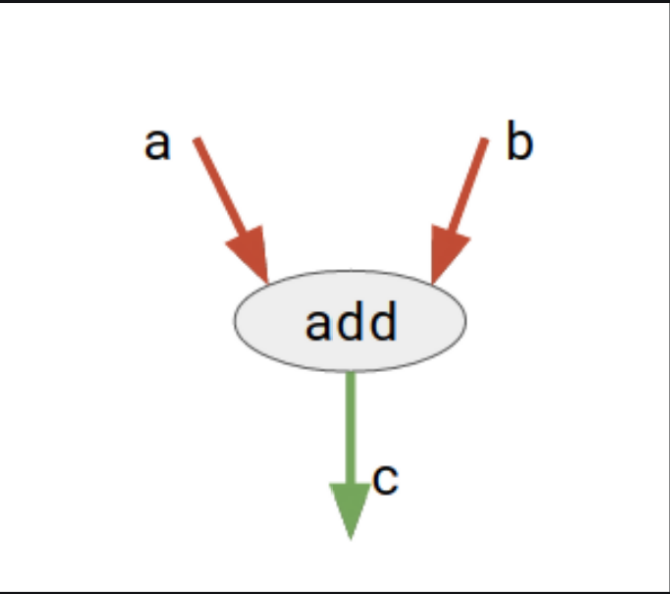

# Tensorflow 架构解析

### Tensorflow 介绍

- 由 Google 开发的端到端机器学习开源平台
- 可伸缩性 & 可延展性
- 分布式训练
- API 等级
    - 低层级 API: Tensorflow Core
    - 高层级 API: ~~tf.contrib~~ → **Keras**

### 计算图

- Tensor(张量) 是 Tensorflow 中的主要单元。

- 结点表示**运算符** (加减乘除、sigmoid、ReLU…)
- 边表示**tensor**

- 静态计算图 & 动态计算图
    - 静态计算图 (tf.Session → tf.function)
        > 在过去，Tensorflow 将计算图构建和 runtime 喂送资料的过程分开来，而这样的设计便是使用 tf.Session 来处理所有数据的流向。
        > 然而，在 2.0 为了能更简化使用者介面，就是让 tf.Session 有如使用 python 一般直觉，那就是以 tf.function 取代。
    - 2.0 中默认采用动态计算图 Eager execution
        > Eager Execution 无需先构建计算图，然后再在 tf.Session 里评估它。它允许用 python 语句控制模型的结构。
        > 它拥有更加直观的界面，以及更自然的流程控制。

### 分层模块架构

**Client**

---

- 用户编写 TensorFlow 程序来构建计算图
- 支持多种编程语言 (优先支持 Python & C++)
    - **Swig 依赖库**：将 C++语言包装成可以支持多种编程语言
- Client 创建一个 session，将图定义为 **tf.GraphDef**，并以 protocal buffer 的形式传送至**Distributed Master**

处理架构

- 一个 worker 表示一个**计算任务(进程)**
- “PS” 表示**Parameter Server**，作用为存储及更新模型中的参数。

计算图 2

**Distributed Master & Work Service**

---

- 只有**分布式 Tensorflow**存在这两个模块
- 核心：图的**分裂**
- **Distributed Master**
    - 将计算图剪枝得到最小依赖子图
    - 再将子图分裂成多个**Partition**，分配在多个 worker 上。
      [Figure 5](https://camo.githubusercontent.com/5f347854075359c666c3d0affdff636089b3242b0e81365b6f4d3ffbfae8064c/68747470733a2f2f7777772e74656e736f72666c6f772e6f72672f696d616765732f67726170685f73706c6974312e737667)
      Figure 5
    - Distributed Master 会在 worker 之间插入**SEND**和**RECV**结点。
      [Figure 6](https://camo.githubusercontent.com/76d707ee6e8b836696d390fb233cb8eaa261e2fbebb17f277a3df12185c6e3dd/68747470733a2f2f7777772e74656e736f72666c6f772e6f72672f696d616765732f67726170685f73706c6974322e737667)
      Figure 6
    - 分布结果：
      [Figure 7](https://camo.githubusercontent.com/c5cf0ef9165c05dc2991629e109a5e80674db3bfbde86ecce802f82454fd9d22/68747470733a2f2f7777772e74656e736f72666c6f772e6f72672f696d616765732f67726170685f776f726b6572735f636c6e2e737667)
      Figure 7
- **Work Services (一个 worker 当中有一个)**
    - worker 中**二次分裂 Partition**
    - 根据**kernel implementations，**选择应该把每个 Partition 放在哪个最适合的硬件当中执行
      
      计算图 with Work Service in each task (根据 kernel 层选择子图应放置到哪一个 hardware)
    - Work Service 会将 kernel operators 分发到多个本地设备，并在允许时并行运行 kernels
    - 设备之间通信：
        - CPU 和 GPU 之间：**`cudaMemcpyAsync()` API**
        - GPU 和 GPU 之间：**peer-to-peer DMA**
    - worker 之间通信：
        - **gRPC over TCP**
        - **RDMA over Converged Ethernet**
          [Figure 8](https://camo.githubusercontent.com/a0e253b76510c1b6bc5342ca1357eb8991c229d0b69247105c34aef4383a5a53/68747470733a2f2f7777772e74656e736f72666c6f772e6f72672f696d616765732f67726170685f73656e645f726563762e737667)
          Figure 8

**Dataflow Executor**

---

- 执行优化过的数据流图

**Kernel Implementations**

---

- 包含超过 200 种的操作函数，包括：
    - 张量运算
    - 控制流
    - 状态管理
- 为不同设备进行相应地优化
- 使用的库：
    - **cuDNN**：更高效地使用 kernels
    - **quantization**：针对移动端提升运算效能
    - **gemmlowp**：低精度的矩阵库

**Device Layer & Networking Layer**

---

- Device layer 与各种不同的硬件沟通，如 CPU、GPU、TPU。
- Networking layer 使用不同网络协议去跟分布计算机交互。

### 逻辑架构

逻辑架构

**训练**

- tf.data：加载训练用的**原始数据**
- tf.keras：**构建**、训练和验证模型
- Eager Execution：**运行**和调试
- Distribution Strategy：进行**分布式训练**
- SavedModel：**保存**导出的训练模型，并且将训练模型标准化输出

**Extras**

**可视化**

- TensorBoard 用于 TensorFlow 可视化

**模型仓库**

- TensorFlow Hub 用于保存训练好的 TensorFlow 模型，供推理或重新训练使用

### Tensorflow 2.0

- 移除**queue runners**输入数据方式，改用**tf.data**
- 在过去 1.x 的时代，`tf.Variable`的状态是由 `tf.Graph`的 graph collection 来管理，而其生命周期则由 `tf.Session`管理。如今，**在 2.0 graph collection 被移除掉后，`tf.Variable`会被当成一般 Python 物件处理。**
